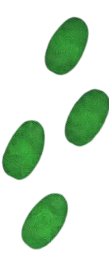

 

### 
A third-year Computer Science (B.Sc.) student in the AI track at SCE, passionate about coding and bringing ideas to life. Strongly interested in artificial intelligence and gaming, combining analytical thinking with a drive for development to build robust applications.

Currently seeking the next challenge in the high-tech industry — stepping into software development, AI, or other technical roles to build impactful solutions and achieve professional growth.

Open for connections and outreach!

 
 

  
  

 
 

### 

  
  
  
  
  
  
  
  
  
  
  

   

 

 

  

 

Made with a terminal-style SVG — dot-matrix portrait rendered from a photo via edge detection.

