 

---

### About

B.Sc. Computer Science student @ SCE (AI Track), Israel — focused on **Artificial Intelligence**.

- 🧠 Core skills: Data Structures, Algorithms, OOP, Machine Learning
- 💻 Languages: Python, Java, C++, C, Assembly (x86)
- 🛠️ Tools: VS Code, PyCharm, Linux, Git, Google Colab

 

Made with a terminal-style SVG — dot-matrix portrait rendered from a photo via edge detection.

